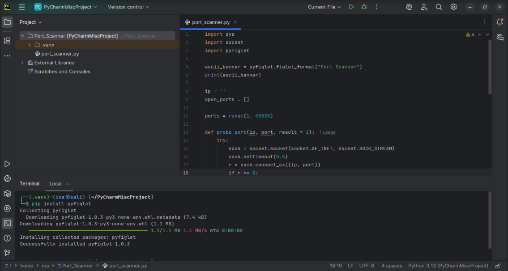

# Custom Python Port Scanner Development

**Objective:** To develop a fundamental port scanner in Python capable of identifying open ports on a target machine. This project demonstrates foundational scripting skills essential for penetration testing.

**Skills Demonstrated:**

* Python Scripting
* Network Programming (Socket Programming)
* Error Handling (Try-Except Blocks)
* Basic Network Reconnaissance Logic
* Tool Development

**Tools Used:**

* **PyCharm:** Integrated Development Environment (IDE) for Python coding.
* **Python 3:** The programming language used for the script.
* **Metasploitable2:** Used as the target machine for testing the scanner.
* **Flameshot:** For capturing high-quality screenshots throughout the project.
* **CherryTree:** For organizing notes, steps, and observations during the assessment.

---

## Project Walk-through:

### Script Development Environment:
I utilized PyCharm as my Integrated Development Environment (IDE) to write and manage the Python script. PyCharm offers excellent features for code completion, debugging, and project organization.



### Target Configuration:
To test the functionality of the scanner, I configured the script to target the Metasploitable2 virtual machine by hardcoding its IP address within the `ip` variable. This allowed for immediate testing against a known vulnerable environment.


### Executing the Scanner and Results:
Upon running the Python script, it systematically scanned a predefined range of ports (1 to 65535) on Metasploitable2. The script successfully identified and reported all open ports on the target, validating its functionality.


---

## Python Port Scanner Code Explanation:

```python

# import sys, import socket, import pyfiglet: Imports necessary modules. sys for system-specific parameters and functions \n (like stdout.flush), socket for network connections, and pyfiglet for generating ASCII art
import sys
import socket
import pyfiglet

# Generate an ASCII banner for the scanner's output
ascii_banner = pyfiglet.figlet_format("Port Scanner")
print(ascii_banner)

ip = '192.168.1.105'  # Hardcoded target IP address for demonstration
open_ports = []      # List to store identified open ports

ports = range(1, 65535)  # Define the range of ports to scan (all possible ports)

def probe_port(ip, port, result = 1):
    """
    Attempts to connect to a specified port on a given IP address.
    Returns 0 if the connection is successful (port is open), otherwise 1.
    """
    try:
        # Create a new socket. AF_INET for IPv4, SOCK_STREAM for TCP.
        sock = socket.socket(socket.AF_INET, socket.SOCK_STREAM)
        # Set a timeout for the connection attempt to avoid long waits on closed ports.
        sock.settimeout(0.5)
        # Attempt to connect to the target IP and port.
        # connect_ex returns an error indicator (0 for success, non-zero for error).
        r = sock.connect_ex((ip, port))
        if r == 0:  # If connection was successful
            result = r  # Update result to 0
        sock.close()  # Close the socket
    except Exception as e:
        # Catch any exceptions during the connection attempt (e.g., host unreachable)
        pass  # Simply ignore the exception, as we're just checking port status
    return result

# Iterate through each port in the defined range
for port in ports:
    sys.stdout.flush()  # Ensures immediate output to the console
    response = probe_port(ip, port)  # Call the probe_port function
    if response == 0:  # If the port is open
        open_ports.append(port)  # Add the port to the list of open ports

# Print the results
if open_ports:
    print("Open ports are: ")
    print(sorted(open_ports)) # Print sorted list of open ports for readability
else:
    print("Looks like no ports are open") # Inform if no open ports were found

